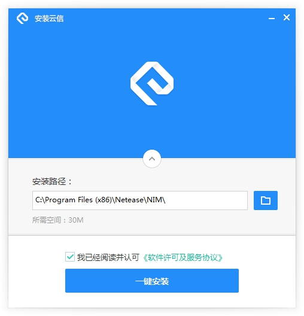
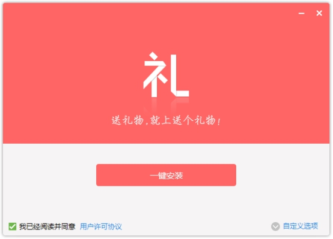
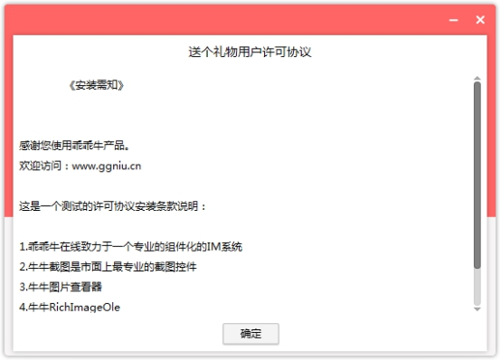
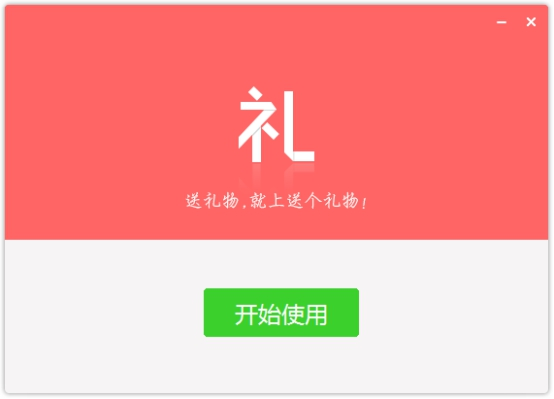

## 控件简介

本说明文档旨在对nsNiuniuSkin.dll控件的使用进行说明，指导调用者顺利的将牛捉安装包界面控件控件集成进安装包中，使第三方产品也能拥有完美的安装包的UI体验功能。

牛牛安装包界面控件是一个可集成于NSIS的插件，采用Duilib开发，在使用时，安装包制作者只需要做如下两件事情：

1. 通过配置Duilib的资源，设计好界面显示的元素

2. 在NSIS的脚本中，通过NSIS脚本调用nsNiuniuSkin.dll的相关接口，集成UI及安装包的业务功能 

在控件的资源中，采用的是通过TAB控件来实现不同阶段的安装界面，比如：选择路径、许可协议、安装进度、完成、卸载等，在实际使用中，通过NSIS脚本来设置当前需要显示的TAB页，即可完美的呈现出需要的界面UI了。 

在我们的示例中，提供了两份安装的界面如下：

 

 

 

 

 

 

***\*注意，最新版本的控件已经将可用的NSIS及7z的相关文件包含在示例包中，可以通过一键打包批处理脚本进行打包了，具体如下：\****

 

1). 将要打包的文件复制到FilesToInstall目录下，可以包含文件及若干层的目录

2). 修改相关项目下的skin目录下的资源文件及xml脚本来配置UI

3). 添加相关（或者在我原来的示例上修改，这样更快）的NSIS脚本文件，并与UI相匹配

4). 指定好相关的ICO、licence等信息 

5). 执行build.bat脚本，一键打包，build脚本会做三件事：将FilesToInstall目录下的文件打包成app.7z；将skin目录下的文件打包成skin.zip；调用nsis编译程序，编译nsi文件，输出安装包。

以上描述的build脚本为全自动执行，可以轻松集成进您现有的软件发布流程中，实现自动化打包发布。

牛牛安装包界面控件包含的接口较多，以下逐一进行介绍[以下接口调用及参数说明按在NSIS脚本中的调用示例来说明]：
