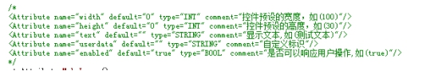

## 获取控件的通用属性

nsNiuniuSkin::GetControlAttribute $hInstallDlg "editDir" "text" 

Pop $2

 

此接口用于获取界面的指定元素的指定属性，比如：是否可用、是否可见，文本等等

 

参数说明：

| 参数序号 | 参数类型 | 参数说明                     | 备注                                         |
| -------- | -------- | ---------------------------- | -------------------------------------------- |
| 1        | 整型     | 用于指定要设置标题的窗口句柄 | 调用init时返回  （可传递子窗口弹窗口的句柄） |
| 2        | 字符串   | 控件的name                   |                                              |
| 3        | 字符串   | 控件的属性名                 |                                              |
|          |          |                              |                                              |

注：

通用的属性列表项可以参照下图：

 

 