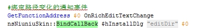
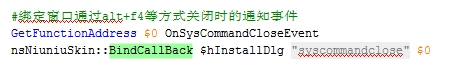

## 绑定UI上控件的相关事件

GetFunctionAddress $0 OnExitDUISetup

nsNiuniuSkin::BindCallBack $hInstallDlg "btnClose" $0

此接口用于绑定一个按钮点击的回调函数或一个RichEdit控件的文字变化时的回调函数。

参数说明：

| 参数序号 | 参数类型 | 参数说明                         | 备注                                                         |
| -------- | -------- | -------------------------------- | ------------------------------------------------------------ |
| 1        | 整型     | 用于指定要设置标题的窗口句柄     | 调用init时返回  （可传递子窗口弹窗口的句柄）                 |
| 2        | 字符串   | UI界面中按钮或richedit控件的name |                                                              |
| 3        | LONG     | 要绑定的NSIS函数的地址           | 当指定名称的按钮被点击或者指定的richedit的内容变化时，绑定的函数将会被触发 |

注：

1). 当绑定的控件是一个RichEdit控件时，其中的文本内容变化时就会触发绑定的函数；可以通过绑定路径的控件，同时在绑定的函数中获取路径，做否合法的判断。

 

 

2). 为了能够将通过Ctrl+F4关闭窗口，以及通过在任务栏关闭窗口的事件通知到NSIS中，此处需要绑定一个特殊的名称，这个特殊的名称是：syscommandclose，如下：

 

 