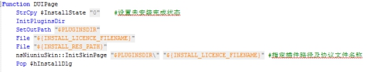
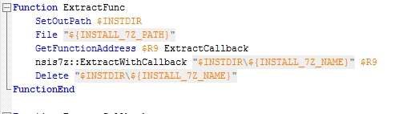
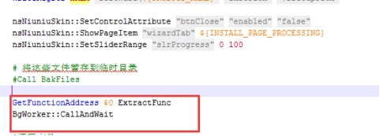
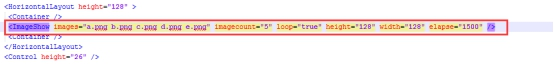

## 其他信息

具体的NSIS脚本及DUILIB的配置文件可以参看DEMO，有如下几个注意事项：

1). DUILIB资源必需打包成zip压缩包，且名称必需是skin.zip

 

2). 在NSIS脚本中，安装与卸载界面中按如下方式指定：

 

此处将插件释放目录指定为duilib资源包及许可协议文件的释放路径。

 

3). 在实际的安装过程中，为了让进度信息尽可能准确，采用的是7z解压的方式

这就要求在制作安装包之前，需要将要安装的文件打包成一个7z 的压缩包，再在NSIS中指定安装：

 

 

在NSIS中，有相关的7z插件来解压，这里需要在线程中调用，以免界面卡住：

 

 

4). 目前提供的示例仅包含了常见的与UI界面相关的NSIS脚本；需要进一步的处理特定的注册表写入、文件备份等操作，需要自行另外再写NSIS脚本。

 

5). 界面的安装过程中的图片支持轮播，并且可以设置间隔时间，在XML中的写法如下：

 

 