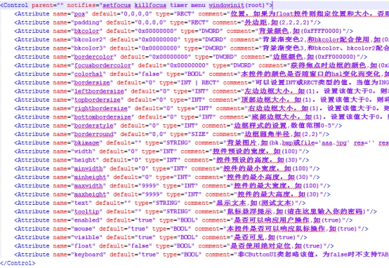
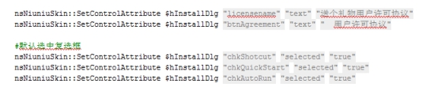

## 指定界面上指定控件的属性

nsNiuniuSkin::SetControlAttribute $hInstallDlg "btnClose" "enabled" "false"

nsNiuniuSkin::SetControlAttribute $hInstallDlg "lblInstalling" "text" "正在卸载..."

 

此接口用于指定界面的指定元素的指定属性，比如：是否可用、是否可见、是否选中、文字、背景图等等

 

参数说明：

| 参数序号 | 参数类型 | 参数说明                     | 备注                                         |
| -------- | -------- | ---------------------------- | -------------------------------------------- |
| 1        | 整型     | 用于指定要设置标题的窗口句柄 | 调用init时返回  （可传递子窗口弹窗口的句柄） |
| 2        | 字符串   | 控件的name                   |                                              |
| 3        | 字符串   | 控件的属性名                 |                                              |
| 4        | 字符串   | 控件的属性值                 |                                              |

注：

可以通过此接口设置所有的通用属性；一般可以利用此接口来设置指定控件的文本、是否可用、是否可见、位置、大小 、背景图、文本颜色等；比如可以用于设置复选框是否选中等等。

通用的属性列表项可以参照下图：

 

 

设置示例如下：

 

 