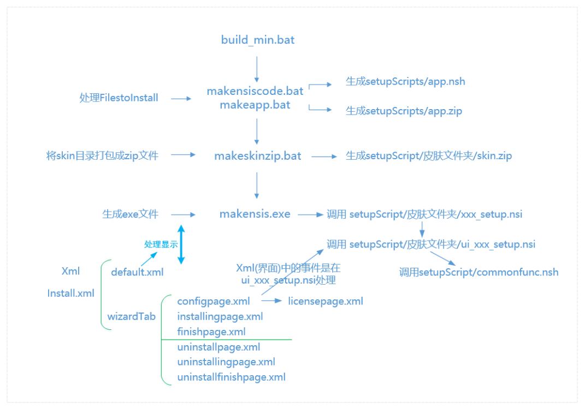

## 快速入门

nsNiuniuSkin是目前国内最专业的安装包UI控件，与NSIS完美融合。同时它也是一个完全免费的安装包UI控件，无任何的使用限制。我们的目标是让稍微有一点NSIS基础的人在一天内完成一个安装包制作。 
更多精美模板，请访问：http://www.leeqia.com/nsniuniuskin/template/

下载链接：http://www.leeqia.com/download/Niuniu_NSIS_SetupSkin.zip

解压后


nsNiuniuSkin流程图



```
\---Niuniu_NSIS_SetupSkin				---根目录
    |   7z.dll
    |   7z.exe
    |   build-nim-nozip.bat					---无7z打包
    |   build-nim.bat						---有7z打包
    |   Description_of_NiuniuSetupSkin.doc ---牛牛安装包界面控件使用说明
    |   makeapp.bat							---生成app.7z
    |   makensiscode.bat					---编译nsis
    |   makeskinzip.bat						---生成skin.zip
    |   NSIS.chm
    |   安装包报毒解决方法.txt
    |   打包配置及流程说明.doc
    |   
    +---FilesToInstall
    |   |   NiuniuCapture.dll
    |   |   牛牛截图.exe
    |   |   
    |   \---testfiles
    |       |   测试文件夹，用于制造相对正常的进度条，正式使用场景请删除.txt
    |       |   ????111.txt
    |       |   
    |       \---????
    |               testfile - 副本 - 副本 (10) - 副本 - 副本 - 副本 - 副本 - 副本 - 副本.txt
    |               testfile - 副本 - 副本 (10) - 副本 - 副本 - 副本 - 副本 - 副本.txt
    |               testfile - 副本 - 副本 (10) - 副本 - 副本 - 副本 - 副本.txt
    |               testfile - 副本 - 副本 (100) - 副本 - 副本 - 副本 - 副本 - 副本 - 副本.txt
    |               testfile - 副本 - 副本 (100) - 副本 - 副本 - 副本 - 副本 - 副本.txt
    |               testfile - 副本 - 副本 (101) - 副本 - 副本 - 副本 - 副本 - 副本 - 副本.txt
    |               testfile - 副本 - 副本 (101) - 副本 - 副本 - 副本 - 副本 - 副本.txt
    |               testfile - 副本 - 副本 (102) - 副本 - 副本 - 副本 - 副本 - 副本 - 副本.txt
    |               testfile - 副本 - 副本 (102) - 副本 - 副本 - 副本 - 副本 - 副本.txt
    |               testfile - 副本 - 副本 (103) - 副本 - 副本 - 副本 - 副本 - 副本 - 副本.txt
    |               testfile - 副本 - 副本 (103) - 副本 - 副本 - 副本 - 副本 - 副本.txt
    |               testfile - 副本 - 副本 (104) - 副本 - 副本 - 副本 - 副本 - 副本 - 副本.txt
    |               testfile - 副本 - 副本 (104) - 副本 - 副本 - 副本 - 副本 - 副本.txt
    |               testfile - 副本 - 副本 (105) - 副本 - 副本 - 副本 - 副本 - 副本 - 副本.txt
    |               testfile - 副本 - 副本 (105) - 副本 - 副本 - 副本 - 副本 - 副本.txt
    |               testfile - 副本 - 副本 (106) - 副本 - 副本 - 副本 - 副本 - 副本 - 副本.txt
    |               testfile - 副本 - 副本 (106) - 副本 - 副本 - 副本 - 副本 - 副本.txt
    |               testfile - 副本 - 副本 (107) - 副本 - 副本 - 副本 - 副本 - 副本 - 副本.txt
    |               testfile - 副本 - 副本 (107) - 副本 - 副本 - 副本 - 副本 - 副本.txt
    |               testfile - 副本 - 副本 (108) - 副本 - 副本 - 副本 - 副本 - 副本 - 副本.txt
    |               testfile - 副本 - 副本 (108) - 副本 - 副本 - 副本 - 副本 - 副本.txt
    |               testfile - 副本 - 副本 (109) - 副本 - 副本 - 副本 - 副本 - 副本 - 副本.txt
    |               testfile - 副本 - 副本 (109) - 副本 - 副本 - 副本 - 副本 - 副本.txt
    |               testfile - 副本 - 副本 (11) - 副本 - 副本 - 副本 - 副本 - 副本 - 副本.txt
    |               testfile - 副本 - 副本 (11) - 副本 - 副本 - 副本 - 副本 - 副本.txt
    |               testfile - 副本 - 副本 (11) - 副本 - 副本 - 副本 - 副本.txt
    |               testfile - 副本 - 副本 (110) - 副本 - 副本 - 副本 - 副本 - 副本 - 副本.txt
    |               testfile - 副本 - 副本 (110) - 副本 - 副本 - 副本 - 副本 - 副本.txt
    |               testfile - 副本 - 副本 (111) - 副本 - 副本 - 副本 - 副本 - 副本 - 副本.txt
    |               testfile - 副本 - 副本 (111) - 副本 - 副本 - 副本 - 副本 - 副本.txt
    |               testfile - 副本 - 副本 (112) - 副本 - 副本 - 副本 - 副本 - 副本.txt
    |               testfile - 副本 - 副本 (113) - 副本 - 副本 - 副本 - 副本 - 副本.txt
    |               testfile - 副本 - 副本 (114) - 副本 - 副本 - 副本 - 副本 - 副本.txt
    |               testfile - 副本 - 副本 (115) - 副本 - 副本 - 副本 - 副本 - 副本.txt
    |               testfile - 副本 - 副本 (116) - 副本 - 副本 - 副本 - 副本 - 副本.txt
    |               testfile - 副本 - 副本 (117) - 副本 - 副本 - 副本 - 副本 - 副本.txt
    |               testfile - 副本 - 副本 (118) - 副本 - 副本 - 副本 - 副本 - 副本.txt
    |               testfile - 副本 - 副本 (119) - 副本 - 副本 - 副本 - 副本 - 副本.txt
    |               testfile - 副本 - 副本 (12) - 副本 - 副本 - 副本 - 副本 - 副本 - 副本.txt
    |               testfile - 副本 - 副本 (12) - 副本 - 副本 - 副本 - 副本 - 副本.txt
    |               testfile - 副本 - 副本 (12) - 副本 - 副本 - 副本 - 副本.txt
    |               testfile - 副本 - 副本 (120) - 副本 - 副本 - 副本 - 副本 - 副本.txt
    |               testfile - 副本 - 副本 (121) - 副本 - 副本 - 副本 - 副本 - 副本.txt
    |               testfile - 副本 - 副本 (122) - 副本 - 副本 - 副本 - 副本 - 副本.txt
    |               testfile - 副本 - 副本 (123) - 副本 - 副本 - 副本 - 副本 - 副本.txt
    |               testfile - 副本 - 副本 (124) - 副本 - 副本 - 副本 - 副本 - 副本.txt
    |               testfile - 副本 - 副本 (125) - 副本 - 副本 - 副本 - 副本 - 副本.txt
    |               testfile - 副本 - 副本 (126) - 副本 - 副本 - 副本 - 副本 - 副本.txt
    |               testfile - 副本 - 副本 (127) - 副本 - 副本 - 副本 - 副本 - 副本.txt
    |               testfile - 副本 - 副本 (128) - 副本 - 副本 - 副本 - 副本 - 副本.txt
    |               testfile - 副本 - 副本 (129) - 副本 - 副本 - 副本 - 副本 - 副本.txt
    |               testfile - 副本 - 副本 (13) - 副本 - 副本 - 副本 - 副本 - 副本 - 副本.txt
    |               testfile - 副本 - 副本 (13) - 副本 - 副本 - 副本 - 副本 - 副本.txt
    |               testfile - 副本 - 副本 (13) - 副本 - 副本 - 副本 - 副本.txt
    |               testfile - 副本 - 副本 (130) - 副本 - 副本 - 副本 - 副本 - 副本.txt
    |               testfile - 副本 - 副本 (131) - 副本 - 副本 - 副本 - 副本 - 副本.txt
    |               testfile - 副本 - 副本 (132) - 副本 - 副本 - 副本 - 副本 - 副本.txt
    |               testfile - 副本 - 副本 (133) - 副本 - 副本 - 副本 - 副本 - 副本.txt
    |               testfile - 副本 - 副本 (134) - 副本 - 副本 - 副本 - 副本 - 副本.txt
    |               testfile - 副本 - 副本 (135) - 副本 - 副本 - 副本 - 副本 - 副本.txt
    |               testfile - 副本 - 副本 (136) - 副本 - 副本 - 副本 - 副本 - 副本.txt
    |               testfile - 副本 - 副本 (137) - 副本 - 副本 - 副本 - 副本 - 副本.txt
    |               testfile - 副本 - 副本 (138) - 副本 - 副本 - 副本 - 副本 - 副本.txt
    |               testfile - 副本 - 副本 (139) - 副本 - 副本 - 副本 - 副本 - 副本.txt
    |               testfile - 副本 - 副本 (14) - 副本 - 副本 - 副本 - 副本 - 副本 - 副本.txt
    |               testfile - 副本 - 副本 (14) - 副本 - 副本 - 副本 - 副本 - 副本.txt
    |               testfile - 副本 - 副本 (14) - 副本 - 副本 - 副本 - 副本.txt
    |               testfile - 副本 - 副本 (140) - 副本 - 副本 - 副本 - 副本 - 副本.txt
    |               testfile - 副本 - 副本 (141) - 副本 - 副本 - 副本 - 副本 - 副本.txt
    |               testfile - 副本 - 副本 (142) - 副本 - 副本 - 副本 - 副本 - 副本.txt
    |               testfile - 副本 - 副本 (143) - 副本 - 副本 - 副本 - 副本 - 副本.txt
    |               testfile - 副本 - 副本 (144) - 副本 - 副本 - 副本 - 副本 - 副本.txt
    |               testfile - 副本 - 副本 (145) - 副本 - 副本 - 副本 - 副本 - 副本.txt
    |               testfile - 副本 - 副本 (146) - 副本 - 副本 - 副本 - 副本 - 副本.txt
    |               testfile - 副本 - 副本 (147) - 副本 - 副本 - 副本 - 副本 - 副本.txt
    |               testfile - 副本 - 副本 (148) - 副本 - 副本 - 副本 - 副本 - 副本.txt
    |               testfile - 副本 - 副本 (149) - 副本 - 副本 - 副本 - 副本 - 副本.txt
    |               testfile - 副本 - 副本 (15) - 副本 - 副本 - 副本 - 副本 - 副本 - 副本.txt
    |               testfile - 副本 - 副本 (15) - 副本 - 副本 - 副本 - 副本 - 副本.txt
    |               testfile - 副本 - 副本 (15) - 副本 - 副本 - 副本 - 副本.txt
    |               testfile - 副本 - 副本 (150) - 副本 - 副本 - 副本 - 副本 - 副本.txt
    |               testfile - 副本 - 副本 (151) - 副本 - 副本 - 副本 - 副本 - 副本.txt
    |               testfile - 副本 - 副本 (152) - 副本 - 副本 - 副本 - 副本 - 副本.txt
    |               testfile - 副本 - 副本 (153) - 副本 - 副本 - 副本 - 副本 - 副本.txt
    |               testfile - 副本 - 副本 (154) - 副本 - 副本 - 副本 - 副本 - 副本.txt
    |               testfile - 副本 - 副本 (155) - 副本 - 副本 - 副本 - 副本 - 副本.txt
    |               testfile - 副本 - 副本 (156) - 副本 - 副本 - 副本 - 副本 - 副本.txt
    |               testfile - 副本 - 副本 (157) - 副本 - 副本 - 副本 - 副本 - 副本.txt
    |               testfile - 副本 - 副本 (158) - 副本 - 副本 - 副本 - 副本 - 副本.txt
    |               testfile - 副本 - 副本 (159) - 副本 - 副本 - 副本 - 副本 - 副本.txt
    |               testfile - 副本 - 副本 (16) - 副本 - 副本 - 副本 - 副本 - 副本 - 副本.txt
    |               testfile - 副本 - 副本 (16) - 副本 - 副本 - 副本 - 副本 - 副本.txt
    |               testfile - 副本 - 副本 (16) - 副本 - 副本 - 副本 - 副本.txt
    |               testfile - 副本 - 副本 (160) - 副本 - 副本 - 副本 - 副本 - 副本.txt
    |               testfile - 副本 - 副本 (161) - 副本 - 副本 - 副本 - 副本 - 副本.txt
    |               testfile - 副本 - 副本 (162) - 副本 - 副本 - 副本 - 副本 - 副本.txt
    |               testfile - 副本 - 副本 (163) - 副本 - 副本 - 副本 - 副本 - 副本.txt
    |               testfile - 副本 - 副本 (164) - 副本 - 副本 - 副本 - 副本 - 副本.txt
    |               testfile - 副本 - 副本 (165) - 副本 - 副本 - 副本 - 副本 - 副本.txt
    |               testfile - 副本 - 副本 (166) - 副本 - 副本 - 副本 - 副本 - 副本.txt
    |               testfile - 副本 - 副本 (167) - 副本 - 副本 - 副本 - 副本 - 副本.txt
    |               testfile - 副本 - 副本 (168) - 副本 - 副本 - 副本 - 副本 - 副本.txt
    |               testfile - 副本 - 副本 (17) - 副本 - 副本 - 副本 - 副本 - 副本 - 副本.txt
    |               testfile - 副本 - 副本 (17) - 副本 - 副本 - 副本 - 副本 - 副本.txt
    |               testfile - 副本 - 副本 (17) - 副本 - 副本 - 副本 - 副本.txt
    |               testfile - 副本 - 副本 (18) - 副本 - 副本 - 副本 - 副本 - 副本 - 副本.txt
    |               testfile - 副本 - 副本 (18) - 副本 - 副本 - 副本 - 副本 - 副本.txt
    |               testfile - 副本 - 副本 (18) - 副本 - 副本 - 副本 - 副本.txt
    |               testfile - 副本 - 副本 (19) - 副本 - 副本 - 副本 - 副本 - 副本 - 副本.txt
    |               testfile - 副本 - 副本 (19) - 副本 - 副本 - 副本 - 副本 - 副本.txt
    |               testfile - 副本 - 副本 (19) - 副本 - 副本 - 副本 - 副本.txt
    |               testfile - 副本 - 副本 (2) - 副本 - 副本 - 副本 - 副本 - 副本 - 副本.txt
    |               testfile - 副本 - 副本 (2) - 副本 - 副本 - 副本 - 副本 - 副本.txt
    |               testfile - 副本 - 副本 (2) - 副本 - 副本 - 副本 - 副本.txt
    |               testfile - 副本 - 副本 (2) - 副本 - 副本 - 副本.txt
    |               testfile - 副本 - 副本 (20) - 副本 - 副本 - 副本 - 副本 - 副本 - 副本.txt
    |               testfile - 副本 - 副本 (20) - 副本 - 副本 - 副本 - 副本 - 副本.txt
    |               testfile - 副本 - 副本 (20) - 副本 - 副本 - 副本 - 副本.txt
    |               testfile - 副本 - 副本 (21) - 副本 - 副本 - 副本 - 副本 - 副本 - 副本.txt
    |               testfile - 副本 - 副本 (21) - 副本 - 副本 - 副本 - 副本 - 副本.txt
    |               testfile - 副本 - 副本 (21) - 副本 - 副本 - 副本 - 副本.txt
    |               testfile - 副本 - 副本 (22) - 副本 - 副本 - 副本 - 副本 - 副本 - 副本.txt
    |               testfile - 副本 - 副本 (22) - 副本 - 副本 - 副本 - 副本 - 副本.txt
    |               testfile - 副本 - 副本 (22) - 副本 - 副本 - 副本 - 副本.txt
    |               testfile - 副本 - 副本 (23) - 副本 - 副本 - 副本 - 副本 - 副本 - 副本.txt
    |               testfile - 副本 - 副本 (23) - 副本 - 副本 - 副本 - 副本 - 副本.txt
    |               testfile - 副本 - 副本 (23) - 副本 - 副本 - 副本 - 副本.txt
    |               testfile - 副本 - 副本 (24) - 副本 - 副本 - 副本 - 副本 - 副本 - 副本.txt
    |               testfile - 副本 - 副本 (24) - 副本 - 副本 - 副本 - 副本 - 副本.txt
    |               testfile - 副本 - 副本 (24) - 副本 - 副本 - 副本 - 副本.txt
    |               testfile - 副本 - 副本 (25) - 副本 - 副本 - 副本 - 副本 - 副本 - 副本.txt
    |               testfile - 副本 - 副本 (25) - 副本 - 副本 - 副本 - 副本 - 副本.txt
    |               testfile - 副本 - 副本 (25) - 副本 - 副本 - 副本 - 副本.txt
    |               testfile - 副本 - 副本 (26) - 副本 - 副本 - 副本 - 副本 - 副本 - 副本.txt
    |               testfile - 副本 - 副本 (26) - 副本 - 副本 - 副本 - 副本 - 副本.txt
    |               testfile - 副本 - 副本 (26) - 副本 - 副本 - 副本 - 副本.txt
    |               testfile - 副本 - 副本 (27) - 副本 - 副本 - 副本 - 副本 - 副本 - 副本.txt
    |               testfile - 副本 - 副本 (27) - 副本 - 副本 - 副本 - 副本 - 副本.txt
    |               testfile - 副本 - 副本 (27) - 副本 - 副本 - 副本 - 副本.txt
    |               testfile - 副本 - 副本 (28) - 副本 - 副本 - 副本 - 副本 - 副本 - 副本.txt
    |               testfile - 副本 - 副本 (28) - 副本 - 副本 - 副本 - 副本 - 副本.txt
    |               testfile - 副本 - 副本 (28) - 副本 - 副本 - 副本 - 副本.txt
    |               testfile - 副本 - 副本 (29) - 副本 - 副本 - 副本 - 副本 - 副本 - 副本.txt
    |               testfile - 副本 - 副本 (29) - 副本 - 副本 - 副本 - 副本 - 副本.txt
    |               testfile - 副本 - 副本 (29) - 副本 - 副本 - 副本 - 副本.txt
    |               testfile - 副本 - 副本 (3) - 副本 - 副本 - 副本 - 副本 - 副本 - 副本.txt
    |               testfile - 副本 - 副本 (3) - 副本 - 副本 - 副本 - 副本 - 副本.txt
    |               testfile - 副本 - 副本 (3) - 副本 - 副本 - 副本 - 副本.txt
    |               testfile - 副本 - 副本 (30) - 副本 - 副本 - 副本 - 副本 - 副本 - 副本.txt
    |               testfile - 副本 - 副本 (30) - 副本 - 副本 - 副本 - 副本 - 副本.txt
    |               testfile - 副本 - 副本 (30) - 副本 - 副本 - 副本 - 副本.txt
    |               testfile - 副本 - 副本 (31) - 副本 - 副本 - 副本 - 副本 - 副本 - 副本.txt
    |               testfile - 副本 - 副本 (31) - 副本 - 副本 - 副本 - 副本 - 副本.txt
    |               testfile - 副本 - 副本 (31) - 副本 - 副本 - 副本 - 副本.txt
    |               testfile - 副本 - 副本 (32) - 副本 - 副本 - 副本 - 副本 - 副本 - 副本.txt
    |               testfile - 副本 - 副本 (32) - 副本 - 副本 - 副本 - 副本 - 副本.txt
    |               testfile - 副本 - 副本 (32) - 副本 - 副本 - 副本 - 副本.txt
    |               testfile - 副本 - 副本 (33) - 副本 - 副本 - 副本 - 副本 - 副本 - 副本.txt
    |               testfile - 副本 - 副本 (33) - 副本 - 副本 - 副本 - 副本 - 副本.txt
    |               testfile - 副本 - 副本 (33) - 副本 - 副本 - 副本 - 副本.txt
    |               testfile - 副本 - 副本 (34) - 副本 - 副本 - 副本 - 副本 - 副本 - 副本.txt
    |               testfile - 副本 - 副本 (34) - 副本 - 副本 - 副本 - 副本 - 副本.txt
    |               testfile - 副本 - 副本 (34) - 副本 - 副本 - 副本 - 副本.txt
    |               testfile - 副本 - 副本 (35) - 副本 - 副本 - 副本 - 副本 - 副本 - 副本.txt
    |               testfile - 副本 - 副本 (35) - 副本 - 副本 - 副本 - 副本 - 副本.txt
    |               testfile - 副本 - 副本 (35) - 副本 - 副本 - 副本 - 副本.txt
    |               testfile - 副本 - 副本 (36) - 副本 - 副本 - 副本 - 副本 - 副本 - 副本.txt
    |               testfile - 副本 - 副本 (36) - 副本 - 副本 - 副本 - 副本 - 副本.txt
    |               testfile - 副本 - 副本 (36) - 副本 - 副本 - 副本 - 副本.txt
    |               testfile - 副本 - 副本 (37) - 副本 - 副本 - 副本 - 副本 - 副本 - 副本.txt
    |               testfile - 副本 - 副本 (37) - 副本 - 副本 - 副本 - 副本 - 副本.txt
    |               testfile - 副本 - 副本 (37) - 副本 - 副本 - 副本 - 副本.txt
    |               testfile - 副本 - 副本 (38) - 副本 - 副本 - 副本 - 副本 - 副本 - 副本.txt
    |               testfile - 副本 - 副本 (38) - 副本 - 副本 - 副本 - 副本 - 副本.txt
    |               testfile - 副本 - 副本 (38) - 副本 - 副本 - 副本 - 副本.txt
    |               testfile - 副本 - 副本 (39) - 副本 - 副本 - 副本 - 副本 - 副本 - 副本.txt
    |               testfile - 副本 - 副本 (39) - 副本 - 副本 - 副本 - 副本 - 副本.txt
    |               testfile - 副本 - 副本 (39) - 副本 - 副本 - 副本 - 副本.txt
    |               testfile - 副本 - 副本 (4) - 副本 - 副本 - 副本 - 副本 - 副本 - 副本.txt
    |               testfile - 副本 - 副本 (4) - 副本 - 副本 - 副本 - 副本 - 副本.txt
    |               testfile - 副本 - 副本 (4) - 副本 - 副本 - 副本 - 副本.txt
    |               testfile - 副本 - 副本 (40) - 副本 - 副本 - 副本 - 副本 - 副本 - 副本.txt
    |               testfile - 副本 - 副本 (40) - 副本 - 副本 - 副本 - 副本 - 副本.txt
    |               testfile - 副本 - 副本 (40) - 副本 - 副本 - 副本 - 副本.txt
    |               testfile - 副本 - 副本 (41) - 副本 - 副本 - 副本 - 副本 - 副本 - 副本.txt
    |               testfile - 副本 - 副本 (41) - 副本 - 副本 - 副本 - 副本 - 副本.txt
    |               testfile - 副本 - 副本 (41) - 副本 - 副本 - 副本 - 副本.txt
    |               testfile - 副本 - 副本 (42) - 副本 - 副本 - 副本 - 副本 - 副本 - 副本.txt
    |               testfile - 副本 - 副本 (42) - 副本 - 副本 - 副本 - 副本 - 副本.txt
    |               testfile - 副本 - 副本 (42) - 副本 - 副本 - 副本 - 副本.txt
    |               testfile - 副本 - 副本 (43) - 副本 - 副本 - 副本 - 副本 - 副本 - 副本.txt
    |               testfile - 副本 - 副本 (43) - 副本 - 副本 - 副本 - 副本 - 副本.txt
    |               testfile - 副本 - 副本 (43) - 副本 - 副本 - 副本 - 副本.txt
    |               testfile - 副本 - 副本 (44) - 副本 - 副本 - 副本 - 副本 - 副本 - 副本.txt
    |               testfile - 副本 - 副本 (44) - 副本 - 副本 - 副本 - 副本 - 副本.txt
    |               testfile - 副本 - 副本 (44) - 副本 - 副本 - 副本 - 副本.txt
    |               testfile - 副本 - 副本 (45) - 副本 - 副本 - 副本 - 副本 - 副本 - 副本.txt
    |               testfile - 副本 - 副本 (45) - 副本 - 副本 - 副本 - 副本 - 副本.txt
    |               testfile - 副本 - 副本 (45) - 副本 - 副本 - 副本 - 副本.txt
    |               testfile - 副本 - 副本 (46) - 副本 - 副本 - 副本 - 副本 - 副本 - 副本.txt
    |               testfile - 副本 - 副本 (46) - 副本 - 副本 - 副本 - 副本 - 副本.txt
    |               testfile - 副本 - 副本 (46) - 副本 - 副本 - 副本 - 副本.txt
    |               testfile - 副本 - 副本 (47) - 副本 - 副本 - 副本 - 副本 - 副本 - 副本.txt
    |               testfile - 副本 - 副本 (47) - 副本 - 副本 - 副本 - 副本 - 副本.txt
    |               testfile - 副本 - 副本 (47) - 副本 - 副本 - 副本 - 副本.txt
    |               testfile - 副本 - 副本 (48) - 副本 - 副本 - 副本 - 副本 - 副本 - 副本.txt
    |               testfile - 副本 - 副本 (48) - 副本 - 副本 - 副本 - 副本 - 副本.txt
    |               testfile - 副本 - 副本 (48) - 副本 - 副本 - 副本 - 副本.txt
    |               testfile - 副本 - 副本 (49) - 副本 - 副本 - 副本 - 副本 - 副本 - 副本.txt
    |               testfile - 副本 - 副本 (49) - 副本 - 副本 - 副本 - 副本 - 副本.txt
    |               testfile - 副本 - 副本 (49) - 副本 - 副本 - 副本 - 副本.txt
    |               testfile - 副本 - 副本 (5) - 副本 - 副本 - 副本 - 副本 - 副本 - 副本.txt
    |               testfile - 副本 - 副本 (5) - 副本 - 副本 - 副本 - 副本 - 副本.txt
    |               testfile - 副本 - 副本 (5) - 副本 - 副本 - 副本 - 副本.txt
    |               testfile - 副本 - 副本 (50) - 副本 - 副本 - 副本 - 副本 - 副本 - 副本.txt
    |               testfile - 副本 - 副本 (50) - 副本 - 副本 - 副本 - 副本 - 副本.txt
    |               testfile - 副本 - 副本 (50) - 副本 - 副本 - 副本 - 副本.txt
    |               testfile - 副本 - 副本 (51) - 副本 - 副本 - 副本 - 副本 - 副本 - 副本.txt
    |               testfile - 副本 - 副本 (51) - 副本 - 副本 - 副本 - 副本 - 副本.txt
    |               testfile - 副本 - 副本 (51) - 副本 - 副本 - 副本 - 副本.txt
    |               testfile - 副本 - 副本 (52) - 副本 - 副本 - 副本 - 副本 - 副本 - 副本.txt
    |               testfile - 副本 - 副本 (52) - 副本 - 副本 - 副本 - 副本 - 副本.txt
    |               testfile - 副本 - 副本 (52) - 副本 - 副本 - 副本 - 副本.txt
    |               testfile - 副本 - 副本 (53) - 副本 - 副本 - 副本 - 副本 - 副本 - 副本.txt
    |               testfile - 副本 - 副本 (53) - 副本 - 副本 - 副本 - 副本 - 副本.txt
    |               testfile - 副本 - 副本 (53) - 副本 - 副本 - 副本 - 副本.txt
    |               testfile - 副本 - 副本 (54) - 副本 - 副本 - 副本 - 副本 - 副本 - 副本.txt
    |               testfile - 副本 - 副本 (54) - 副本 - 副本 - 副本 - 副本 - 副本.txt
    |               testfile - 副本 - 副本 (54) - 副本 - 副本 - 副本 - 副本.txt
    |               testfile - 副本 - 副本 (55) - 副本 - 副本 - 副本 - 副本 - 副本 - 副本.txt
    |               testfile - 副本 - 副本 (55) - 副本 - 副本 - 副本 - 副本 - 副本.txt
    |               testfile - 副本 - 副本 (55) - 副本 - 副本 - 副本 - 副本.txt
    |               testfile - 副本 - 副本 (56) - 副本 - 副本 - 副本 - 副本 - 副本 - 副本.txt
    |               testfile - 副本 - 副本 (56) - 副本 - 副本 - 副本 - 副本 - 副本.txt
    |               testfile - 副本 - 副本 (56) - 副本 - 副本 - 副本 - 副本.txt
    |               testfile - 副本 - 副本 (57) - 副本 - 副本 - 副本 - 副本 - 副本 - 副本.txt
    |               testfile - 副本 - 副本 (57) - 副本 - 副本 - 副本 - 副本 - 副本.txt
    |               testfile - 副本 - 副本 (57) - 副本 - 副本 - 副本 - 副本.txt
    |               testfile - 副本 - 副本 (58) - 副本 - 副本 - 副本 - 副本 - 副本 - 副本.txt
    |               testfile - 副本 - 副本 (58) - 副本 - 副本 - 副本 - 副本 - 副本.txt
    |               testfile - 副本 - 副本 (58) - 副本 - 副本 - 副本 - 副本.txt
    |               testfile - 副本 - 副本 (59) - 副本 - 副本 - 副本 - 副本 - 副本 - 副本.txt
    |               testfile - 副本 - 副本 (59) - 副本 - 副本 - 副本 - 副本 - 副本.txt
    |               testfile - 副本 - 副本 (59) - 副本 - 副本 - 副本 - 副本.txt
    |               testfile - 副本 - 副本 (6) - 副本 - 副本 - 副本 - 副本 - 副本 - 副本.txt
    |               testfile - 副本 - 副本 (6) - 副本 - 副本 - 副本 - 副本 - 副本.txt
    |               testfile - 副本 - 副本 (6) - 副本 - 副本 - 副本 - 副本.txt
    |               testfile - 副本 - 副本 (60) - 副本 - 副本 - 副本 - 副本 - 副本 - 副本.txt
    |               testfile - 副本 - 副本 (60) - 副本 - 副本 - 副本 - 副本 - 副本.txt
    |               testfile - 副本 - 副本 (61) - 副本 - 副本 - 副本 - 副本 - 副本 - 副本.txt
    |               testfile - 副本 - 副本 (61) - 副本 - 副本 - 副本 - 副本 - 副本.txt
    |               testfile - 副本 - 副本 (62) - 副本 - 副本 - 副本 - 副本 - 副本 - 副本.txt
    |               testfile - 副本 - 副本 (62) - 副本 - 副本 - 副本 - 副本 - 副本.txt
    |               testfile - 副本 - 副本 (63) - 副本 - 副本 - 副本 - 副本 - 副本 - 副本.txt
    |               testfile - 副本 - 副本 (63) - 副本 - 副本 - 副本 - 副本 - 副本.txt
    |               testfile - 副本 - 副本 (64) - 副本 - 副本 - 副本 - 副本 - 副本 - 副本.txt
    |               testfile - 副本 - 副本 (64) - 副本 - 副本 - 副本 - 副本 - 副本.txt
    |               testfile - 副本 - 副本 (65) - 副本 - 副本 - 副本 - 副本 - 副本 - 副本.txt
    |               testfile - 副本 - 副本 (65) - 副本 - 副本 - 副本 - 副本 - 副本.txt
    |               testfile - 副本 - 副本 (66) - 副本 - 副本 - 副本 - 副本 - 副本 - 副本.txt
    |               testfile - 副本 - 副本 (66) - 副本 - 副本 - 副本 - 副本 - 副本.txt
    |               testfile - 副本 - 副本 (67) - 副本 - 副本 - 副本 - 副本 - 副本 - 副本.txt
    |               testfile - 副本 - 副本 (67) - 副本 - 副本 - 副本 - 副本 - 副本.txt
    |               testfile - 副本 - 副本 (68) - 副本 - 副本 - 副本 - 副本 - 副本 - 副本.txt
    |               testfile - 副本 - 副本 (68) - 副本 - 副本 - 副本 - 副本 - 副本.txt
    |               testfile - 副本 - 副本 (69) - 副本 - 副本 - 副本 - 副本 - 副本 - 副本.txt
    |               testfile - 副本 - 副本 (69) - 副本 - 副本 - 副本 - 副本 - 副本.txt
    |               testfile - 副本 - 副本 (7) - 副本 - 副本 - 副本 - 副本 - 副本 - 副本.txt
    |               testfile - 副本 - 副本 (7) - 副本 - 副本 - 副本 - 副本 - 副本.txt
    |               testfile - 副本 - 副本 (7) - 副本 - 副本 - 副本 - 副本.txt
    |               testfile - 副本 - 副本 (70) - 副本 - 副本 - 副本 - 副本 - 副本 - 副本.txt
    |               testfile - 副本 - 副本 (70) - 副本 - 副本 - 副本 - 副本 - 副本.txt
    |               testfile - 副本 - 副本 (71) - 副本 - 副本 - 副本 - 副本 - 副本 - 副本.txt
    |               testfile - 副本 - 副本 (71) - 副本 - 副本 - 副本 - 副本 - 副本.txt
    |               testfile - 副本 - 副本 (72) - 副本 - 副本 - 副本 - 副本 - 副本 - 副本.txt
    |               testfile - 副本 - 副本 (72) - 副本 - 副本 - 副本 - 副本 - 副本.txt
    |               testfile - 副本 - 副本 (73) - 副本 - 副本 - 副本 - 副本 - 副本 - 副本.txt
    |               testfile - 副本 - 副本 (73) - 副本 - 副本 - 副本 - 副本 - 副本.txt
    |               testfile - 副本 - 副本 (74) - 副本 - 副本 - 副本 - 副本 - 副本 - 副本.txt
    |               testfile - 副本 - 副本 (74) - 副本 - 副本 - 副本 - 副本 - 副本.txt
    |               testfile - 副本 - 副本 (75) - 副本 - 副本 - 副本 - 副本 - 副本 - 副本.txt
    |               testfile - 副本 - 副本 (75) - 副本 - 副本 - 副本 - 副本 - 副本.txt
    |               testfile - 副本 - 副本 (76) - 副本 - 副本 - 副本 - 副本 - 副本 - 副本.txt
    |               testfile - 副本 - 副本 (76) - 副本 - 副本 - 副本 - 副本 - 副本.txt
    |               testfile - 副本 - 副本 (77) - 副本 - 副本 - 副本 - 副本 - 副本 - 副本.txt
    |               testfile - 副本 - 副本 (77) - 副本 - 副本 - 副本 - 副本 - 副本.txt
    |               testfile - 副本 - 副本 (78) - 副本 - 副本 - 副本 - 副本 - 副本 - 副本.txt
    |               testfile - 副本 - 副本 (78) - 副本 - 副本 - 副本 - 副本 - 副本.txt
    |               testfile - 副本 - 副本 (79) - 副本 - 副本 - 副本 - 副本 - 副本 - 副本.txt
    |               testfile - 副本 - 副本 (79) - 副本 - 副本 - 副本 - 副本 - 副本.txt
    |               testfile - 副本 - 副本 (8) - 副本 - 副本 - 副本 - 副本 - 副本 - 副本.txt
    |               testfile - 副本 - 副本 (8) - 副本 - 副本 - 副本 - 副本 - 副本.txt
    |               testfile - 副本 - 副本 (8) - 副本 - 副本 - 副本 - 副本.txt
    |               testfile - 副本 - 副本 (80) - 副本 - 副本 - 副本 - 副本 - 副本 - 副本.txt
    |               testfile - 副本 - 副本 (80) - 副本 - 副本 - 副本 - 副本 - 副本.txt
    |               testfile - 副本 - 副本 (81) - 副本 - 副本 - 副本 - 副本 - 副本 - 副本.txt
    |               testfile - 副本 - 副本 (81) - 副本 - 副本 - 副本 - 副本 - 副本.txt
    |               testfile - 副本 - 副本 (82) - 副本 - 副本 - 副本 - 副本 - 副本 - 副本.txt
    |               testfile - 副本 - 副本 (82) - 副本 - 副本 - 副本 - 副本 - 副本.txt
    |               testfile - 副本 - 副本 (83) - 副本 - 副本 - 副本 - 副本 - 副本 - 副本.txt
    |               testfile - 副本 - 副本 (83) - 副本 - 副本 - 副本 - 副本 - 副本.txt
    |               testfile - 副本 - 副本 (84) - 副本 - 副本 - 副本 - 副本 - 副本 - 副本.txt
    |               testfile - 副本 - 副本 (84) - 副本 - 副本 - 副本 - 副本 - 副本.txt
    |               testfile - 副本 - 副本 (85) - 副本 - 副本 - 副本 - 副本 - 副本 - 副本.txt
    |               testfile - 副本 - 副本 (85) - 副本 - 副本 - 副本 - 副本 - 副本.txt
    |               testfile - 副本 - 副本 (86) - 副本 - 副本 - 副本 - 副本 - 副本 - 副本.txt
    |               testfile - 副本 - 副本 (86) - 副本 - 副本 - 副本 - 副本 - 副本.txt
    |               testfile - 副本 - 副本 (87) - 副本 - 副本 - 副本 - 副本 - 副本 - 副本.txt
    |               testfile - 副本 - 副本 (87) - 副本 - 副本 - 副本 - 副本 - 副本.txt
    |               testfile - 副本 - 副本 (88) - 副本 - 副本 - 副本 - 副本 - 副本 - 副本.txt
    |               testfile - 副本 - 副本 (88) - 副本 - 副本 - 副本 - 副本 - 副本.txt
    |               testfile - 副本 - 副本 (89) - 副本 - 副本 - 副本 - 副本 - 副本 - 副本.txt
    |               testfile - 副本 - 副本 (89) - 副本 - 副本 - 副本 - 副本 - 副本.txt
    |               testfile - 副本 - 副本 (9) - 副本 - 副本 - 副本 - 副本 - 副本 - 副本.txt
    |               testfile - 副本 - 副本 (9) - 副本 - 副本 - 副本 - 副本 - 副本.txt
    |               testfile - 副本 - 副本 (9) - 副本 - 副本 - 副本 - 副本.txt
    |               testfile - 副本 - 副本 (90) - 副本 - 副本 - 副本 - 副本 - 副本 - 副本.txt
    |               testfile - 副本 - 副本 (90) - 副本 - 副本 - 副本 - 副本 - 副本.txt
    |               testfile - 副本 - 副本 (91) - 副本 - 副本 - 副本 - 副本 - 副本 - 副本.txt
    |               testfile - 副本 - 副本 (91) - 副本 - 副本 - 副本 - 副本 - 副本.txt
    |               testfile - 副本 - 副本 (92) - 副本 - 副本 - 副本 - 副本 - 副本 - 副本.txt
    |               testfile - 副本 - 副本 (92) - 副本 - 副本 - 副本 - 副本 - 副本.txt
    |               testfile - 副本 - 副本 (93) - 副本 - 副本 - 副本 - 副本 - 副本 - 副本.txt
    |               testfile - 副本 - 副本 (93) - 副本 - 副本 - 副本 - 副本 - 副本.txt
    |               testfile - 副本 - 副本 (94) - 副本 - 副本 - 副本 - 副本 - 副本 - 副本.txt
    |               testfile - 副本 - 副本 (94) - 副本 - 副本 - 副本 - 副本 - 副本.txt
    |               testfile - 副本 - 副本 (95) - 副本 - 副本 - 副本 - 副本 - 副本 - 副本.txt
    |               testfile - 副本 - 副本 (95) - 副本 - 副本 - 副本 - 副本 - 副本.txt
    |               testfile - 副本 - 副本 (96) - 副本 - 副本 - 副本 - 副本 - 副本 - 副本.txt
    |               testfile - 副本 - 副本 (96) - 副本 - 副本 - 副本 - 副本 - 副本.txt
    |               testfile - 副本 - 副本 (97) - 副本 - 副本 - 副本 - 副本 - 副本 - 副本.txt
    |               testfile - 副本 - 副本 (97) - 副本 - 副本 - 副本 - 副本 - 副本.txt
    |               testfile - 副本 - 副本 (98) - 副本 - 副本 - 副本 - 副本 - 副本 - 副本.txt
    |               testfile - 副本 - 副本 (98) - 副本 - 副本 - 副本 - 副本 - 副本.txt
    |               testfile - 副本 - 副本 (99) - 副本 - 副本 - 副本 - 副本 - 副本 - 副本.txt
    |               testfile - 副本 - 副本 (99) - 副本 - 副本 - 副本 - 副本 - 副本.txt
    |               
    +---NSIS
    |   |   COPYING
    |   |   makensis.exe
    |   |   makensisw.exe
    |   |   NSIS.exe
    |   |   nsisconf.nsh
    |   |   
    |   +---Bin
    |   |       GenPat.exe
    |   |       LibraryLocal.exe
    |   |       MakeLangId.exe
    |   |       RegTool.bin
    |   |       zip2exe.exe
    |   |       
    |   +---Contrib
    |   |   +---Graphics
    |   |   |   +---Checks
    |   |   |   |       big.bmp
    |   |   |   |       classic-cross.bmp
    |   |   |   |       classic.bmp
    |   |   |   |       colorful.bmp
    |   |   |   |       grey-cross.bmp
    |   |   |   |       grey.bmp
    |   |   |   |       modern.bmp
    |   |   |   |       red-round.bmp
    |   |   |   |       red.bmp
    |   |   |   |       simple-round.bmp
    |   |   |   |       simple-round2.bmp
    |   |   |   |       simple.bmp
    |   |   |   |       
    |   |   |   +---Header
    |   |   |   |       nsis-r.bmp
    |   |   |   |       nsis.bmp
    |   |   |   |       orange-nsis.bmp
    |   |   |   |       orange-r-nsis.bmp
    |   |   |   |       orange-r.bmp
    |   |   |   |       orange-uninstall-nsis.bmp
    |   |   |   |       orange-uninstall-r-nsis.bmp
    |   |   |   |       orange-uninstall-r.bmp
    |   |   |   |       orange-uninstall.bmp
    |   |   |   |       orange.bmp
    |   |   |   |       win.bmp
    |   |   |   |       
    |   |   |   +---Icons
    |   |   |   |       arrow-install.ico
    |   |   |   |       arrow-uninstall.ico
    |   |   |   |       arrow2-install.ico
    |   |   |   |       arrow2-uninstall.ico
    |   |   |   |       box-install.ico
    |   |   |   |       box-uninstall.ico
    |   |   |   |       classic-install.ico
    |   |   |   |       classic-uninstall.ico
    |   |   |   |       llama-blue.ico
    |   |   |   |       llama-grey.ico
    |   |   |   |       modern-install-blue-full.ico
    |   |   |   |       modern-install-blue.ico
    |   |   |   |       modern-install-colorful.ico
    |   |   |   |       modern-install-full.ico
    |   |   |   |       modern-install.ico
    |   |   |   |       modern-uninstall-blue-full.ico
    |   |   |   |       modern-uninstall-blue.ico
    |   |   |   |       modern-uninstall-colorful.ico
    |   |   |   |       modern-uninstall-full.ico
    |   |   |   |       modern-uninstall.ico
    |   |   |   |       nsis1-install.ico
    |   |   |   |       nsis1-uninstall.ico
    |   |   |   |       orange-install-nsis.ico
    |   |   |   |       orange-install.ico
    |   |   |   |       orange-uninstall-nsis.ico
    |   |   |   |       orange-uninstall.ico
    |   |   |   |       pixel-install.ico
    |   |   |   |       pixel-uninstall.ico
    |   |   |   |       win-install.ico
    |   |   |   |       win-uninstall.ico
    |   |   |   |       
    |   |   |   \---Wizard
    |   |   |           arrow.bmp
    |   |   |           llama.bmp
    |   |   |           nsis.bmp
    |   |   |           nullsoft.bmp
    |   |   |           orange-nsis.bmp
    |   |   |           orange-uninstall-nsis.bmp
    |   |   |           orange-uninstall.bmp
    |   |   |           orange.bmp
    |   |   |           win.bmp
    |   |   |           
    |   |   +---Language files
    |   |   |       Afrikaans.nlf
    |   |   |       Afrikaans.nsh
    |   |   |       Albanian.nlf
    |   |   |       Albanian.nsh
    |   |   |       Arabic.nlf
    |   |   |       Arabic.nsh
    |   |   |       Basque.nlf
    |   |   |       Basque.nsh
    |   |   |       Belarusian.nlf
    |   |   |       Belarusian.nsh
    |   |   |       Bosnian.nlf
    |   |   |       Bosnian.nsh
    |   |   |       Breton.nlf
    |   |   |       Breton.nsh
    |   |   |       Bulgarian.nlf
    |   |   |       Bulgarian.nsh
    |   |   |       Catalan.nlf
    |   |   |       Catalan.nsh
    |   |   |       Croatian.nlf
    |   |   |       Croatian.nsh
    |   |   |       Czech.nlf
    |   |   |       Czech.nsh
    |   |   |       Danish.nlf
    |   |   |       Danish.nsh
    |   |   |       Dutch.nlf
    |   |   |       Dutch.nsh
    |   |   |       English.nlf
    |   |   |       English.nsh
    |   |   |       Esperanto.nlf
    |   |   |       Esperanto.nsh
    |   |   |       Estonian.nlf
    |   |   |       Estonian.nsh
    |   |   |       Farsi.nlf
    |   |   |       Farsi.nsh
    |   |   |       Finnish.nlf
    |   |   |       Finnish.nsh
    |   |   |       French.nlf
    |   |   |       French.nsh
    |   |   |       Galician.nlf
    |   |   |       Galician.nsh
    |   |   |       German.nlf
    |   |   |       German.nsh
    |   |   |       Greek.nlf
    |   |   |       Greek.nsh
    |   |   |       Hebrew.nlf
    |   |   |       Hebrew.nsh
    |   |   |       Hungarian.nlf
    |   |   |       Hungarian.nsh
    |   |   |       Icelandic.nlf
    |   |   |       Icelandic.nsh
    |   |   |       Indonesian.nlf
    |   |   |       Indonesian.nsh
    |   |   |       Irish.nlf
    |   |   |       Irish.nsh
    |   |   |       Italian.nlf
    |   |   |       Italian.nsh
    |   |   |       Japanese.nlf
    |   |   |       Japanese.nsh
    |   |   |       Korean.nlf
    |   |   |       Korean.nsh
    |   |   |       Kurdish.nlf
    |   |   |       Kurdish.nsh
    |   |   |       Latvian.nlf
    |   |   |       Latvian.nsh
    |   |   |       Lithuanian.nlf
    |   |   |       Lithuanian.nsh
    |   |   |       Luxembourgish.nlf
    |   |   |       Luxembourgish.nsh
    |   |   |       Macedonian.nlf
    |   |   |       Macedonian.nsh
    |   |   |       Malay.nlf
    |   |   |       Malay.nsh
    |   |   |       Mongolian.nlf
    |   |   |       Mongolian.nsh
    |   |   |       Norwegian.nlf
    |   |   |       Norwegian.nsh
    |   |   |       NorwegianNynorsk.nlf
    |   |   |       NorwegianNynorsk.nsh
    |   |   |       Polish.nlf
    |   |   |       Polish.nsh
    |   |   |       Portuguese.nlf
    |   |   |       Portuguese.nsh
    |   |   |       PortugueseBR.nlf
    |   |   |       PortugueseBR.nsh
    |   |   |       Romanian.nlf
    |   |   |       Romanian.nsh
    |   |   |       Russian.nlf
    |   |   |       Russian.nsh
    |   |   |       Serbian.nlf
    |   |   |       Serbian.nsh
    |   |   |       SerbianLatin.nlf
    |   |   |       SerbianLatin.nsh
    |   |   |       SimpChinese.nlf
    |   |   |       SimpChinese.nsh
    |   |   |       Slovak.nlf
    |   |   |       Slovak.nsh
    |   |   |       Slovenian.nlf
    |   |   |       Slovenian.nsh
    |   |   |       Spanish.nlf
    |   |   |       Spanish.nsh
    |   |   |       SpanishInternational.nlf
    |   |   |       SpanishInternational.nsh
    |   |   |       Swedish.nlf
    |   |   |       Swedish.nsh
    |   |   |       Thai.nlf
    |   |   |       Thai.nsh
    |   |   |       TradChinese.nlf
    |   |   |       TradChinese.nsh
    |   |   |       Turkish.nlf
    |   |   |       Turkish.nsh
    |   |   |       Ukrainian.nlf
    |   |   |       Ukrainian.nsh
    |   |   |       Uzbek.nlf
    |   |   |       Uzbek.nsh
    |   |   |       Welsh.nlf
    |   |   |       Welsh.nsh
    |   |   |       
    |   |   +---Modern UI
    |   |   |       ioSpecial.ini
    |   |   |       System.nsh
    |   |   |       
    |   |   +---Modern UI 2
    |   |   |   |   Deprecated.nsh
    |   |   |   |   Interface.nsh
    |   |   |   |   Localization.nsh
    |   |   |   |   MUI2.nsh
    |   |   |   |   Pages.nsh
    |   |   |   |   
    |   |   |   \---Pages
    |   |   |           Components.nsh
    |   |   |           Directory.nsh
    |   |   |           Finish.nsh
    |   |   |           InstallFiles.nsh
    |   |   |           License.nsh
    |   |   |           StartMenu.nsh
    |   |   |           UninstallConfirm.nsh
    |   |   |           Welcome.nsh
    |   |   |           
    |   |   +---UIs
    |   |   |       default.exe
    |   |   |       modern.exe
    |   |   |       modern_headerbmp.exe
    |   |   |       modern_headerbmpr.exe
    |   |   |       modern_nodesc.exe
    |   |   |       modern_smalldesc.exe
    |   |   |       sdbarker_tiny.exe
    |   |   |       
    |   |   \---zip2exe
    |   |           Base.nsh
    |   |           Classic.nsh
    |   |           Modern.nsh
    |   |           
    |   +---Include
    |   |   |   Colors.nsh
    |   |   |   common.nsh
    |   |   |   FileFunc.nsh
    |   |   |   InstallOptions.nsh
    |   |   |   LangFile.nsh
    |   |   |   Library.nsh
    |   |   |   Locate.nsh
    |   |   |   LogicLib.nsh
    |   |   |   Memento.nsh
    |   |   |   MUI.nsh
    |   |   |   MUI2.nsh
    |   |   |   MultiUser.nsh
    |   |   |   nsDialogs.nsh
    |   |   |   nsOpenUrl.nsh
    |   |   |   nsProcess.nsh
    |   |   |   Sections.nsh
    |   |   |   StrFunc.nsh
    |   |   |   TextFunc.nsh
    |   |   |   UpgradeDLL.nsh
    |   |   |   Util.nsh
    |   |   |   VB6RunTime.nsh
    |   |   |   VPatchLib.nsh
    |   |   |   WinCore.nsh
    |   |   |   WinMessages.nsh
    |   |   |   WinVer.nsh
    |   |   |   WordFunc.nsh
    |   |   |   x64.nsh
    |   |   |   
    |   |   \---Win
    |   |           WinDef.nsh
    |   |           WinError.nsh
    |   |           WinNT.nsh
    |   |           WinUser.nsh
    |   |           
    |   +---Plugins
    |   |       AdvSplash.dll
    |   |       Banner.dll
    |   |       BgImage.dll
    |   |       BgWorker.dll
    |   |       Dialer.dll
    |   |       InstallOptions.dll
    |   |       LangDLL.dll
    |   |       locate.dll
    |   |       Math.dll
    |   |       nsCommon.dll
    |   |       nsDialogs.dll
    |   |       nsExec.dll
    |   |       nsis7zU.dll
    |   |       NSISdl.dll
    |   |       nsNiuniuSkin.dll
    |   |       nsProcess.dll
    |   |       Splash.dll
    |   |       StartMenu.dll
    |   |       System.dll
    |   |       TypeLib.dll
    |   |       UserInfo.dll
    |   |       VPatch.dll
    |   |       
    |   \---Stubs
    |           bzip2
    |           bzip2_solid
    |           lzma
    |           lzma_solid
    |           uninst
    |           zlib
    |           zlib_solid
    |           
    +---Output
    |       NIM_PC_Setup_v2.5.0.exe
    |       
    \---SetupScripts
        |   commonfunc.nsh
        |   
        \---nim
            |   licence.rtf
            |   license.txt
            |   logo.ico
            |   nim_setup.nsi
            |   skin.zip
            |   ui_nim_setup.nsh
            |   uninst.ico
            |   
            \---skin
                |   arrow_down.png
                |   arrow_up.png
                |   bg1.png
                |   bg2.png
                |   bgbottom.png
                |   bgtop.png
                |   bk_shadow.png
                |   cancel.png
                |   checkbox.png
                |   close.png
                |   close1.png
                |   configpage.xml
                |   default.xml
                |   finishpage.xml
                |   install.png
                |   install.xml
                |   installingpage.xml
                |   licensepage.xml
                |   license_bg.png
                |   min.png
                |   min1.png
                |   modify.png
                |   msgBox.xml
                |   msgWarning.png
                |   ok.png
                |   pic.png
                |   process_bottom.png
                |   process_top.png
                |   scroll.png
                |   uninstall.png
                |   uninstallfinishpage.xml
                |   uninstallingpage.xml
                |   uninstallpage.xml
                |   uninstall_bg1.png
                |   uninstall_bg2.png
                |   uninstall_bg3.png
                |   uninst_ok.png
                |   uninst_process_bottom.png
                |   uninst_process_top.png
                |   
                +---form
                |       bg.png
                |       bk_down.png
                |       btn_down_hovered.png
                |       btn_down_normal.png
                |       btn_down_pressed.png
                |       btn_installation_disable.png
                |       btn_installation_hovered.png
                |       btn_installation_normal.png
                |       btn_installation_pressed.png
                |       btn_path_hovered.png
                |       btn_path_normal.png
                |       btn_path_pressed.png
                |       btn_up_hovered.png
                |       btn_up_normal.png
                |       btn_up_pressed.png
                |       error.png
                |       fg.png
                |       infor.png
                |       licence.xml
                |       msgbox.xml
                |       ok.png
                |       pic.png
                |       question.png
                |       setup_form.xml
                |       warning.png
                |       
                \---public
                    +---bk
                    |       bk_shadow.png
                    |       
                    +---button
                    |       btn_global_green_80x30_hovered.png
                    |       btn_global_green_80x30_normal.png
                    |       btn_global_green_80x30_pushed.png
                    |       btn_global_white_80x30_hovered.png
                    |       btn_global_white_80x30_normal.png
                    |       btn_global_white_80x30_pushed.png
                    |       btn_wnd_close_hovered.png
                    |       btn_wnd_close_pushed.png
                    |       btn_wnd_gray_close.png
                    |       btn_wnd_gray_max.png
                    |       btn_wnd_gray_max_hovered.png
                    |       btn_wnd_gray_max_pushed.png
                    |       btn_wnd_gray_min.png
                    |       btn_wnd_gray_min_hovered.png
                    |       btn_wnd_gray_min_pushed.png
                    |       btn_wnd_gray_restore.png
                    |       btn_wnd_gray_restore_hovered.png
                    |       btn_wnd_gray_restore_pushed.png
                    |       btn_wnd_white_close.png
                    |       btn_wnd_white_min.png
                    |       btn_wnd_white_min_hovered.png
                    |       btn_wnd_white_min_pushed.png
                    |       
                    +---caption
                    |       caption_public.png
                    |       
                    +---checkbox
                    |       check_green_no.png
                    |       check_green_yes.png
                    |       check_no.png
                    |       check_yes.png
                    |       check_yes1.png
                    |       
                    +---edit
                    |       edit0.png
                    |       
                    \---vsrcollbar
                            bk_hovered.png
                            bk_normal.png
                            thumb_hovered.png
                            thumb_normal.png
```

